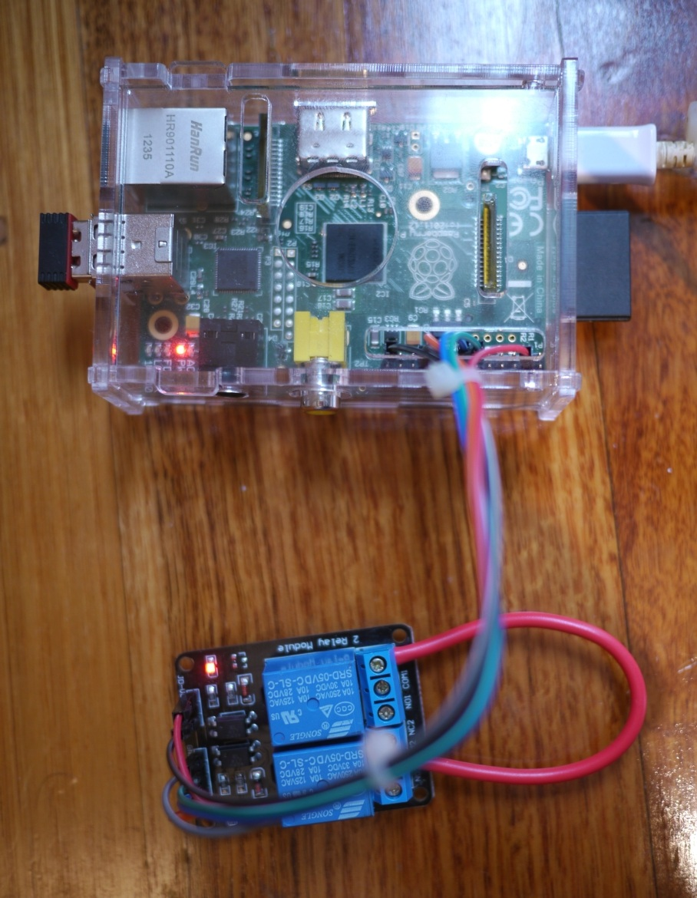
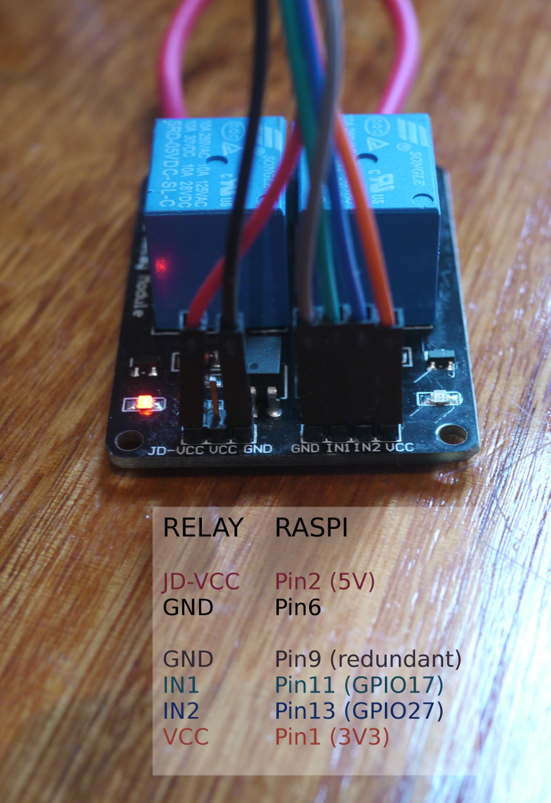
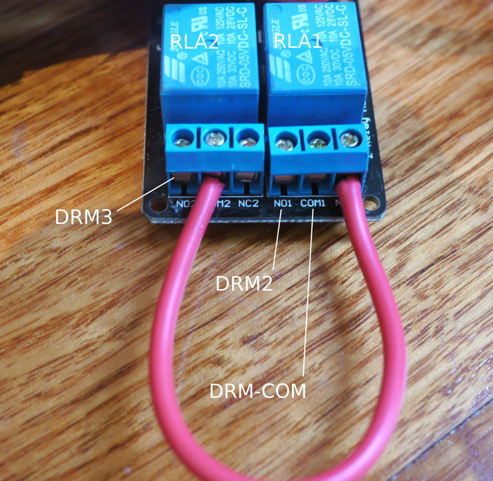

# dreadpi
Demand Response Enabling Device (DRED) for Raspberry Pi.

Dreadpi enables automatic control of air conditioning DRM modes based on your current renewable power generation.
It achieves this by controlling a relay board connected to the RasPi GPIO pins.
This can reduce your grid energy consumption by better aligning your peak load with your peak generation.

DRED is an AU/NZ standard (AS/NZS 4755).

Supported collectors:
* api.enphaseenergy.com (enlighten)
* pvoutput.org
* standalone script




# Requirements

* RasPi hardware (you'll be error-bombed if dreadpi can't access the broadcom chip).
* Dual Double Throw Relay module ($3 online) and leads ($1 online).
* Root access (for controlling the broadcom chip).
* Python 3.x.
* RPi.GPIO Python 3 module (raspbian package "python3-rpi.gpio").

# Install

Install to ./dreadpi/:
```
git clone https://github.com/robdevops/dreadpi.git
```

# Test
```
sudo ./dreadpi/dreadpi.py
```

# Config

At minimum, a data source must be confgured. You'll need to obtain API keys and replace XXX values for the API collectors to work, but you can test with the default 'external_script' setting.
```
dreadpi.cfg
```


## Schedule

Creating an example cron which captures the last output to a file:
```
# Note: Running this too often will shorten the relay life
echo "*/15 5-21 * * *     root    /root/dreadpi/dreadpi.py > /var/log/dreadpi.cron.lastrun 2>&1" > /etc/cron.d/dreadpi
```

## Logging

Critical errors:
````
/var/log/dreadpi.errorlog.txt
````
DRM states (for graphing purposes, states are expressed as a % of max energy use):
````
/var/log/dreadpi.plotlog.txt
````


# Security

Because controlling the RasPi GPIO pins requires root access, the following restrictions have been implemented:
* Dreadpi runs all its collectors as the 'nobody' user.
* The external_script filename can not contain most special shell characters.
* Online APIs use hard coded URL prefixes.

Because API keys are read/write, and the API data itself is a potential privacy concern, your config should not be world readable (and obviously not world writeable):
````
sudo chmod 600 dreadpi/dreadpi.cfg
````


# Wiring

Disclaimer: This info is provided for educational purposes. Don't mess around with mains voltage appliances; they're dangerous. Your safety is your own responsibility.

## Jumper:
* Remove the relay module jumper closing JD-VCC and VCC.

## RasPi to relay (control pins):
* PIN1 (3V3)		-> VCC
* PIN2 (5V)		-> JD-VCC
* PIN6 (GND)		-> GND
* PIN11 (GPIO17)	-> IN1
* PIN13 (GPIO27)	-> IN2
* PIN9 (GND)		-> GND (redundant)


## Relay to DRM (switch pins):
* RLA1-COM		->	DRM-COM
* RLA2-COM		->	RLA1-NC
* RLA1-NO		->	DRM2
* RLA2-NO		->	DRM3
* RLA2-NC		->	(none) rest position, informally "drm0".



# Contribute

You can easily add new collectors. Incidentally, the PVOutput documentation provides many third party code examples for accessing various smart invertors:
http://pvoutput.org/help.html#integration-contributed-software

To integrate with dredPi, just drop a .py in the lib directory and have it return a value in watts.
Load it from energy.py like this:
```
from lib import <your collector>
```
And call it like this:
```
elif DATA_SOURCE == "<your collector>":
    watts = <your collector>.<your function>()
```
To be accepted upstream, also:
* Pass your user configuration from dreadpi.cfg:
```
elif DATA_SOURCE == "<your collector>":
    watts = <your collector>.<your function>(USER, KEY, SYSID)
```
* Copy/Paste the logging block from another collector (requires import logging and import os).

Ideally your collector would also:
* Return a POSIX content timestamp:
```
elif DATA_SOURCE == "<your collector>":
    watts, content_timestamp = <your collector>.<your function>(USER, KEY, SYSID)
```
* Perform exception handling and health warnings as per existing examples.
* Have well commented code.

Note: collectors must be able to run as 'nobody'.

This was my first ever attempt at Python. I welcome suggestions on how to do anything more elegantly, no matter how trivial. Just log an issue or DM me. Thanks and happy hacking!

